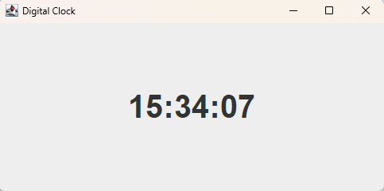

# ⏰ Digital Clock

Полнофункциональное приложение цифровых часов на Java Swing.

## ✨ Особенности

• ⏰ Отображение текущего времени  
• 🔄 Обновление каждую секунду  
• 🕒 Формат ЧЧ:ММ:СС  
• 💻 Удобный интерфейс  

## 🚀 Быстрый запуск

1. Скачать проект  
2. Открыть в IntelliJ IDEA  
3. Запустить файл DigitalClock.java  
4. Использовать приложение  

## 📷 Скриншоты

## 🛠 Технологии

• Java  
• Java Swing  
• AWT  
• Timer  

